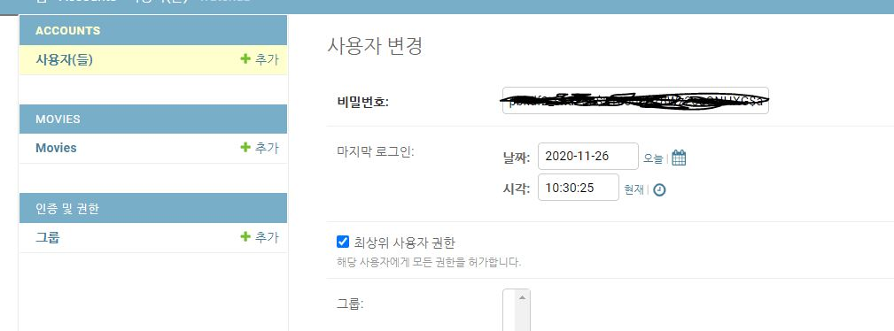

# README

[TOC]

## 0. 배포 서버 URL


## 1. 팀원 정보 및 업무 분담 내역

팀장 : 조성국 (front : 100%, back : 20%)

- 영상 제작
- front 전체 코드 작성
- TMDB API 활용 및 json 생성
- movies app 추가 구현


팀원 : 황윤호 (back : 80%)

- TMDM API 활용 및 json 생성, 데이터 넣기
- 좋아요 누른 영화의 장르 기반 추천 알고리즘 구현 ( 이미 본 영화도 제외 )
- accounts app 기본 구현
- movies app 기본 구현 ( movies에 community 기능 포함 )


## 2. 목표 서비스 구현 및 실제 구현 정도

### A. 개발 도구


### B. 영화

- 홈 화면, Carousel


TMDB에서 호출한 영화 데이터들을 Carousel을 활용하여 홈 화면에서 보여줍니다.

사용자가 화면 크기를 조절함에 따라 반응형으로 보여지는 영화들의 개수가 줄어듭니다.


- 영화 상세 정보 및 커뮤니티 기능


사용자가 하나의 영화를 클릭하면 해당 영화의 상세 정보를 보여주며 평점, 댓글을 달 수 있는 커뮤니티 기능을 넣었습니다.


- 좋아하는 영화 / 내가 본 영화


영화 상세 페이지에서 좋아요를 누르면 내가 좋아하는 영화에 추가됩니다.

영화 상세 페이지에서 내가 본 영화를 누르면 내가 본 영화에 추가됩니다.


- 추천 알고리즘 (좋아요 / 내가 본 영화)


`알고리즘 설명`

사용자가  좋아요를 누르면 해당 영화의 장르들을 수집합니다.

여러 영화에 좋아요를 누를수록 영화 장르들이 데이터에 많이 쌓이게 됩니다. (좋아요를 취소하면 데이터에서 없어집니다.)


> 숫자들은 영화 장르 id 값

모은 데이터를 기반으로 사용자가 좋아하는 상위 4개의 장르들을 뽑아냅니다.


최상위 장르는 반드시 포함하고 2~4번째 장르는 Q 를 활용하여 포함시키거나 포함시키지 않았습니다.


- 보고싶은 영화


사용자는 보고싶은 영화를 추가해놓고 나중에 확인할 수 있습니다. 다른 유저들은 접근할 수 없습니다.


### C. 커뮤니티 ( B. 영화에 포함되어 있음)

### D. 관리

승인된 스태프 (is_staff 값이 1)만 접근 가능하며, 영화와 회원을 관리할 수 있는 페이지입니다.

(django admin)


#### a. 영화 관리

- 영화 등록 / 수정 / 삭제


관리자는 영화 등록 / 수정 / 삭제가 가능합니다.


#### b. 회원 관리

- 사용자 관리


- 관리자 계정 (최상위 사용자 권한)




- 관리자 (등록 / 수정 / 삭제)


관리자는 영화 등록 / 수정 / 삭제가 가능합니다.


### E. 회원가입 / 로그인 / 로그아웃


> 로그인 한 유저의 상단 배너 예시

회원가입 / 로그인 / 로그아웃이 가능합니다.


## 3. 데이터베이스 모델링(ERD)


## 4. 기타

### A. final-pjt-back 폴더 구성

```markdown
├── .vscode
|	├── settings.json
├── venv
├── watchub
|	├── accounts
|	|	├── __pycache__
|	|	├── migrations
|	|	└── templates
|	|	|	├── accounts
|	|	|		├── login.html
|	|	|		└── signup.html
|	|	├── __init__.py
|	|	├── __admin__.py
|	|	├── apps.py
|	|	├── forms.py
|	|	├── models.py
|	|	├── serializers.py
|	|	├── tests.py
|	|	├── urls.py
|	|	└── views.py
|	|
│   ├── movies
│	│	├── __pycache__
│	│	├── fixtures
|	|	|	└── Movie.json
│	│	├── migrations
│	│	├── __init__.py
│	│	├── admin.py
│	│	├── apps.py
│	│	├── forms.py
│	│	├── models.py
│	│	├── serializers.py
│	│	├── tests.py
│	│	├── urls.py
│	│	└── views.py
│   ├── watchub
│	│	├── __pycache__
│	│	├── templates
│	│	│	└── base.html
│	│	├── __init__.py
│	│	├── asgi.py
│	│	├── settings.py
│	│	├── urls.py
│	│	└── wsgi.py
│   ├── db.sqlite3
│   |── manage.py
|	└── requirements.txt
│
├── .gitignore
└── README.md
```

### B. final-pjt-front 폴더 구성

```markdown
├── node_modules
|    ├── ...
├── public
|    ├── index.html
|    ├── style.css
|    ├── favicon.ico
├── src
|    ├── assets
|    ├── components
|    |    ├── Home
|    |    |    ├── Carousel.vue
|    |    |    ├── Classic.vue
|    |    |    ├── Latest.vue
|    |    |    ├── Popular.vue
|    |    ├── MyMvie
|    |    |    ├── Favorite.vue
|    |    |    ├── Already.vue
|    |    |    ├── Wishlist.vue
|    ├── router
|    ├── store
|    ├── views
|    |    ├── accounts
|    |    |    ├── Login.vue
|    |    |    ├── Signup.vue
|    |    ├── Home.vue
|    |    ├── MyMovie.vue
|    |    ├── Recommend.vue
|    |    ├── ReommendCarousel.vue
```

### C. 느낀점

- API를 다루는 것이 어려웠습니다. 백엔드에서 데이터를 곧바로 쓸 수 있게끔 넘겨주어야 했지만, 대부분 수정이 필요했습니다. 필요한 데이터를 불러오고, 보내주는 작업에서 시간이 많이 소모된 것 같습니다.

  프로젝트를 하면서 자신감이 많이 떨어진 순간이 있었습니다. 마음대로 안되고, 도움이 안되는 것 같아 많이 자책했습니다. 하지만 팀장님이 모르는 부분은 상세하게 알려주고, 실수를 하더라도 용기를 복둗어 주었습니다.

  스스로에게 많은 도움이 되었던 프로젝트였습니다. 부족한 점을 알았고, 어느정도 개선할 수 있었습니다. 이번 프로젝트는 향후 다른 프로젝트를 진행할 때 도움이 많이 될 것 같습니다. 